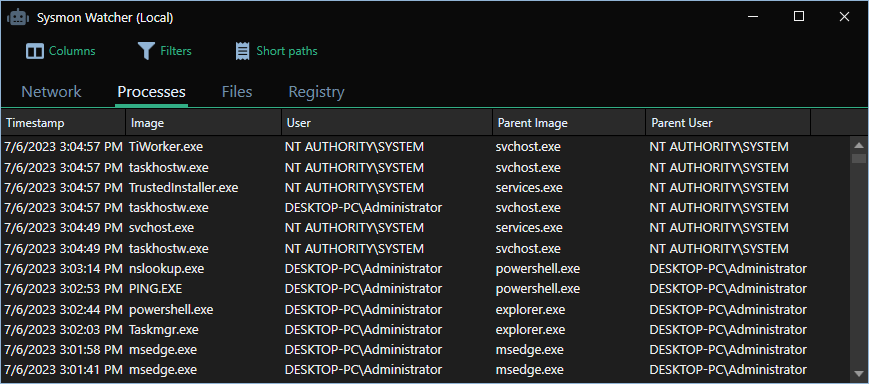

# Sysmon-Watcher

Sysmon-Watcher provides real-time monitoring for logs generated by [Microsoft Sysmon](https://learn.microsoft.com/en-us/sysinternals/downloads/sysmon). In addition to monitoring your local system, you can remotely monitor any computer on your network.

## Download

[Click here to download the latest version](https://github.com/r-smith/sysmon-watcher/releases/latest/download/sysmon-watcher.exe)
- No installer. Just download and run the .exe.
- .NET 4.5 or greater required.

## Features

- Real-time monitoring of Sysmon event logs.
- Watch your local system or remotely monitor any computer on your network.
- Each log field maps to a column.
- Choose the columns you want to see.
- Advanced filtering on any field.
